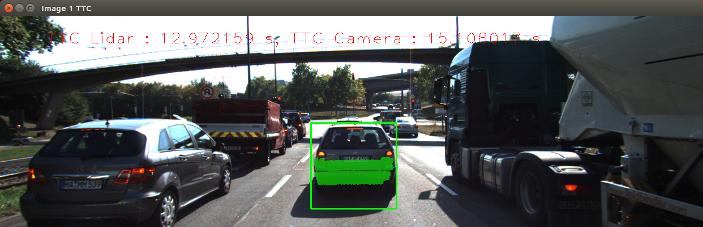
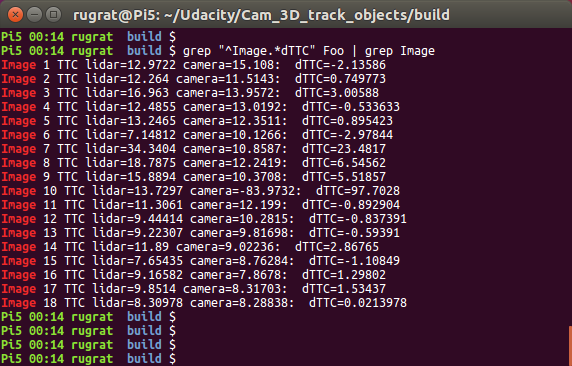
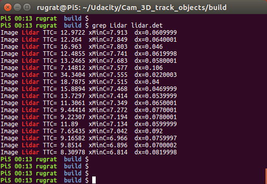
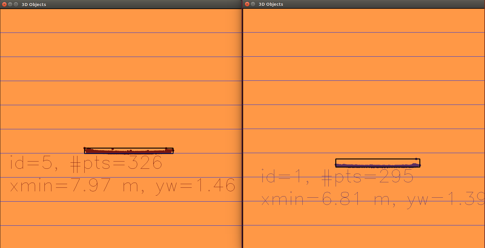

# Estimating TTC with Camera Image and Lidar data

## Final Project of Camera Section
This write-up reports tasks that were performed in completion of the final project. The objective is to use camera images and lidar scan data to estimate time to collision (TTC) of a host vehicle ("ego car") from a sequence of synchronized lidar scans and rgb images. Investigations into lidar TTC estimate error sources, and performance of various keypoint matching methods used in camera based TTC estimation are also performed.

### Coding

The following software creation tasks were given and completed:

1. Match 3D Objects;
2. Compute lidar based TTC;
3. Associate matched keypoints to bounding boxes;
4. Compute camera based TTC.

These tasks are found in files in the 'src' directory. There is a separate file for each task to better isolate and review them.These files were broken out from the camFusion_Student.cpp file. The CMakeLists.txt file has been accordingly updated.

The source compiles and executes except that 'yolo' config files needed to run the application must be provided. They were too large for the free repository on gitub.

### Lidar based TTC Estimates

The image above shows estimates of TTC using both camera images and lidar. We see for the most part reasonable agreement between the two methods. But there are oddities in the mix. To get a getter take on the Lidar TTC estimate we can look at the distance to the leading vehicle over the sequence of scans. This is shown in the image below.

Lidar measurements indicate that the distance to the preceding vehicle is steadily decreasing from 7.913m to 6.814m in 17 steps. This is an average decrease of 0.065m/step. We see this average decrease in the image, but there are instances of deviation. A reason for this variation or error could be lack of accuracy. Note that the inverse relationship between distance decrease, and singularity at zero velocity, small variations can lead to large swings in TTC. But another factor is simply defining what is the location of the preceding vehicle to the ego car. Our working definition is the nearest reasonable lidar point.

The image above shows an overhead rendition of two lidar scans, the first and the last. Note that you don't have a TTC estimate until the second scan.

